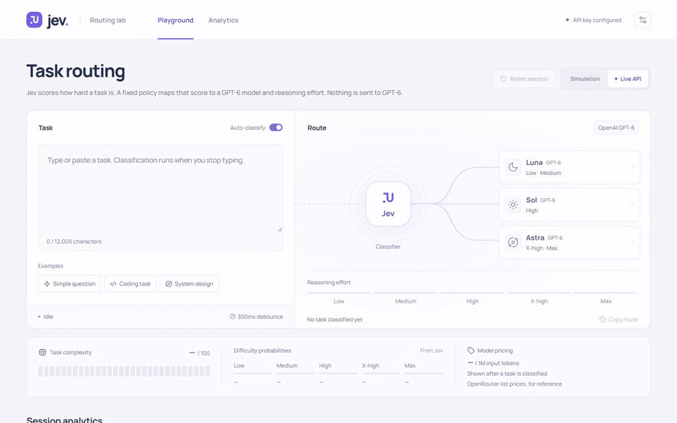
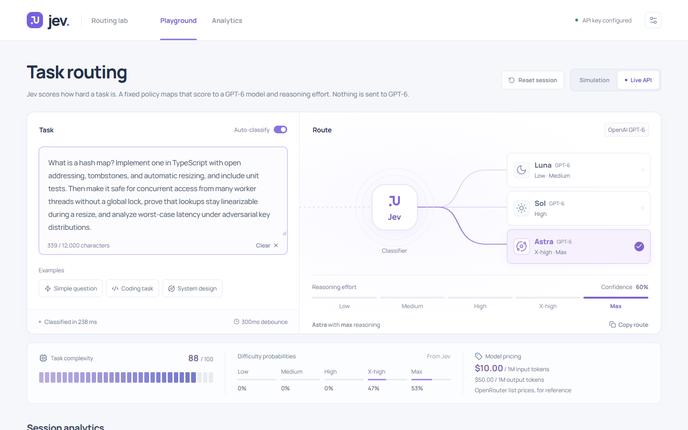
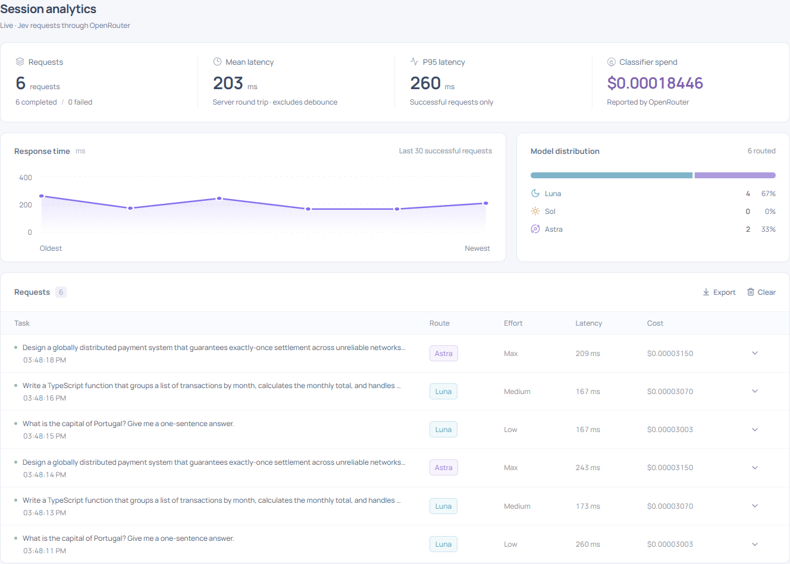

# Jev Routing Lab

A visual, interactive demo of using **Jev to assess task complexity**, then applying a routing policy to recommend **GPT-6 Luna, Sol, or Astra** and a reasoning effort from **low through max**.

Typing pauses for 300 ms before a classification is queued. The interface shows the decision, probability distribution, complexity signals, request history, latency, and classification spend. It recommends a target model; it does **not** invoke the GPT-6 models or generate their answers.

## Demo



Recorded against the live Jev API. The task is typed in one go, with short pauses at punctuation. Each pause of 300 ms or more sends the current text to Jev, so the task is classified eight times as it grows:

| Text so far ends with…                            | Complexity | Route               |
| ------------------------------------------------- | ---------: | ------------------- |
| "What is a hash map?"                             |          4 | Luna, low effort    |
| "…Implement one in TypeScript with open addressing," |      43 | Sol, high effort    |
| "…and include unit tests."                        |         50 | Sol, high effort    |
| "…Then make it safe for concurrent access…"       |         68 | Astra, x-high effort |
| "…prove that lookups stay linearizable…"          |         88 | Astra, max effort   |

While the next classification is pending, the previous route stays on screen, dimmed. [MP4 version](docs/media/live-typing.mp4) (sharper, 1440×900).

| Final route for the full task                            | Session analytics after a few example tasks          |
| -------------------------------------------------------- | ---------------------------------------------------- |
|  |  |

## Run locally

Use Node.js 22 or newer.

```sh
npm install
npm run dev
```

Open **http://127.0.0.1:5173**. The Vite frontend proxies `/api` to the Express server at port 3001. A free, explicitly labeled **Simulation** mode works without credentials.

For live Jev, edit the included `.env` file. If starting from a fresh checkout, create `.env` using `.env.example` first:

```dotenv
OPENROUTER_API_KEY=your_openrouter_key
JEV_MODEL=typesafe/jev-1.13
PORT=3001
HOST=127.0.0.1
```

Restart `npm run dev` after changing `.env`, then select **Live API**. The key stays on the server; it is never returned by `/api/config` or embedded in the browser bundle. `.env` is gitignored. Do not add a `VITE_` prefix to the key. If changing the backend port during development, also update the proxy target in `vite.config.ts`.

The server binds to localhost by default. This sample has no user authentication or shared billing controls; add those before exposing the live endpoint publicly.

### Deploy to Vercel

The repo includes `vercel.json` and `api/index.mjs`. Vercel serves the built frontend from `dist/` and runs the Express API as a serverless function, so `HOST` and `PORT` are not used. Import the repo in Vercel, then set these under **Settings → Environment Variables**:

- `OPENROUTER_API_KEY`: leave it unset for a Simulation-only deployment.
- `JEV_MODEL` (optional): defaults to `typesafe/jev-1.13`.

A public deployment with a key lets anyone who finds the URL spend that key's credits. Use a dedicated key with a low credit limit.

```sh
npm test
npm run build
npm start
```

The production server serves the built app at **http://127.0.0.1:3001**. Tests mock OpenRouter and never use an API key or spend credits.

## What Jev does

The backend calls the [OpenRouter Decisions API](https://openrouter.ai/docs/api/api-reference/alphadecisions/submit-a-decisions-request) at `POST https://openrouter.ai/api/alpha/decisions`, using `typesafe/jev-1.13`. This is Jev's typed decision endpoint, separate from chat completions.

One request contains the task and four typed questions:

- A **Score** question places the task on five ordered levels of reasoning difficulty.
- Three **Noul** questions estimate whether substantial reasoning, domain expertise, and interacting constraints are needed.

The probability bars come from Jev's returned distribution. Confidence is the API's concentration measure, not a guarantee of correctness. The signal percentages are probabilities that their described property is needed; they are not independent measures of task completion quality. The full, editable rubric is in `server/classifier.mjs`.

The application converts the Score from `0–4` to `0–100`, then rounds the original score to choose an effort and model:

| Jev score            | Effort | Recommended model |
| -------------------- | ------ | ----------------- |
| 0 to less than 0.5   | low    | GPT-6 Luna        |
| 0.5 to less than 1.5 | medium | GPT-6 Luna        |
| 1.5 to less than 2.5 | high   | GPT-6 Sol         |
| 2.5 to less than 3.5 | xhigh  | GPT-6 Astra       |
| 3.5 to 4             | max    | GPT-6 Astra       |

These thresholds are a transparent demonstration policy, not a benchmarked claim that a model or effort is optimal. Jev supplies semantic judgments; application code owns the routing. To tune this for production, evaluate the rubric and thresholds on representative tasks and desired quality/cost tradeoffs. See OpenRouter's [Jev tutorial](https://openrouter.ai/blog/tutorials/how-to-use-jev/) for guidance on typed questions and policy calibration.

All five displayed efforts, including `max`, were verified in the GPT-6 Luna, Sol, and Astra entries of [OpenRouter's model catalog API](https://openrouter.ai/api/v1/models) on September 25, 2026. **Copy route** copies a model ID and `reasoning.effort` recommendation; add the task as a message when integrating it into a complete chat request. See the [reasoning parameter documentation](https://openrouter.ai/docs/guides/best-practices/reasoning-tokens).

## Analytics and pricing

Live request costs use OpenRouter's returned `usage.cost` in USD. If it is missing for the known Jev 1.13 model, the server estimates cost from the returned token counts and the price snapshot below, labeling it `estimated`. For an unknown model with no returned cost, cost is `null` and its source is `unavailable`. Token counts include the complete Jev input, including the rubric.

Latency measures the server's complete OpenRouter round trip, including reading the decision response. The 300 ms typing debounce is separate. Requests are serialized in the browser; when typing outruns a request, only the newest queued input is sent next. Completed older requests remain in the session ledger for accounting but do not replace the latest visible decision. While a new classification is pending, the previous decision stays visible but dimmed.

The displayed session spend covers recorded completed requests, not an account invoice. A network failure, timeout, tab close, or disconnect can occur after OpenRouter has accepted a billable request; its unreturned usage cannot be known here. History lives in browser memory and is reset on reload. **Clear** in the request log removes the visible mode's history; **Reset session** at the top of the page clears the task, the current route, and history for both modes. Neither runs while a request is pending, so a possibly billed call is always recorded first.

Demo mode uses a deterministic local keyword heuristic. Its scores, confidence, and distributions are **synthetic**, latency is actual local computation time, token counts and billed cost are zero, and it makes **no OpenRouter request**. A live failure is displayed as an error and never silently replaced by simulated data.

Public standard pricing checked **September 25, 2026** (USD per million tokens):

| Model       |  Input | Output | Source                                                    |
| ----------- | -----: | -----: | --------------------------------------------------------- |
| Jev 1.13    | $0.042 |     $0 | [OpenRouter](https://openrouter.ai/typesafe/jev-1.13/api) |
| GPT-6 Luna  |  $0.10 |  $0.50 | [OpenRouter](https://openrouter.ai/openai/gpt-6-luna)     |
| GPT-6 Sol   |     $2 |    $10 | [OpenRouter](https://openrouter.ai/openai/gpt-6-sol)      |
| GPT-6 Astra |    $10 |    $50 | [OpenRouter](https://openrouter.ai/openai/gpt-6-astra)    |

The target-model prices are informational snapshots, not charges incurred by this demo. Cache, tool, provider, and service-tier pricing may differ. Update `MODELS`, `CLASSIFIER_PRICING`, and `PRICING_DATE` in `server/classifier.mjs` when refreshing prices.

## API

`GET /api/config` returns credential availability, the classifier model, debounce interval, input limit, model catalog, supported effort levels, and source-linked pricing. It returns no credentials.

`POST /api/classify` accepts:

```json
{ "prompt": "Explain how a hash map works.", "mode": "live" }
```

Use `"demo"` for local simulation. Prompts must contain 1–12,000 characters. The response is a classification object with `id`, `timestamp`, `mode`, `prompt`, `complexity`, `difficulty`, `model`, `confidence`, `probabilities`, `signals`, `latencyMs`, `usage`, and `classifierModel`. Model is the key `luna`, `sol`, or `astra`; the catalog supplies the public model ID.

Errors use `{ "error": { "code": "…", "message": "…" } }`. Missing configuration, invalid JSON/input, upstream authentication/credit/rate-limit failures, invalid responses, and 15-second upstream timeouts are handled explicitly. Provider error bodies and keys are not forwarded or logged. Closing a request aborts its upstream fetch when possible.

## Project structure

| Path                    | Purpose                                                                      |
| ----------------------- | ---------------------------------------------------------------------------- |
| `src/`                  | React interface, queue/debounce logic, and in-memory analytics               |
| `server/classifier.mjs` | Jev rubric, response validation, cost accounting, routing policy, local demo |
| `server/app.mjs`        | Express API and production static hosting                                    |
| `server/index.mjs`      | Environment loading and server startup                                       |
| `server/*.test.mjs`     | Mocked contract, validation, cost, timeout, and HTTP integration tests       |
| `.env.example`          | Server-only environment template                                             |
